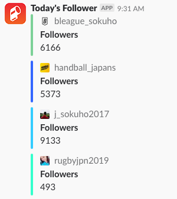

# twitter-follower-notifier

Post twitter followers_count on slack

## ENV

You need to specify the ENV values below.

```
# [Required]

# Twitter Auth
TWITTER_ACCESS_TOKEN=YOUR_TOKEN
TWITTER_ACCESS_TOKEN_SECRET=YOUR_TOKEN_SECRET
TWITTER_CONSUMER_KEY=YOUR_CONSUMER_KEY
TWITTER_CONSUMER_SECRET=YOUR_CONSUMER_SECRET

# Comma-separated screen_names
TWITTER_SCREEN_NAMES=bleague_sokuho,handball_japans,j_sokuho2017,rugbyjpn2019,CheerHaruV,hir0shima_carp,b2_sokuho,kokoyakyu_soku,wjbl_sokuho

# Slack Webhook URL
WEBHOOK_URL=YOUR_WEBHOOK_URL

# [Optional]

# Comma-separated follow_targets for the index corresponding to screen_names
# 10000,,10000 means the follower targets for 0 and 2 index of screen_names are 10000.
# The rest are no tagret.
TWITTER_FOLLOWER_TARGETS=10000,,10000
# The message to show the diff for the target follower
# This is only used when you specify TWITTER_FOLLOWER_TARGETS.
TWITTER_TARGET_DIFF_MESSAGE: 🍣🍣🍣 まであと
```

### heroku config

If you want to update the heroku config, you can easily do that with `heroku config:set`.
See more: https://devcenter.heroku.com/articles/config-vars

Here is the very simple sample.

```
heroku config:set TWITTER_ACCESS_TOKEN=YOUR_TOKEN TWITTER_ACCESS_TOKEN_SECRET=YOUR_TOKEN_SECRET -a twitter-follower-notifier
```

## Deploy to heroku

```
git add remote heroku https://git.heroku.com/twitter-follower-notifier.git
git push heroku master
```

## Scheduling

The script is executed once daily by using Heroku Scheduler.

```
ruby twitter_follower_notifier.rb
```

## Sample Results


